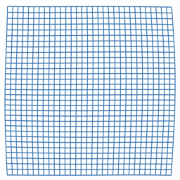

Geometric Calculus
==================

This library provides geometric calculus functionality in python

Arguably, 'the geometric derivative is all you need'; it truly is the swiss army knife of partial differential equations.

Note that this library is not currently written with the purpose of being suitable for any production purposes; but rather to serve as an exploratory playground, and a way to facilitate the spread of interesting ideas.

It contains a submodule for both continuous and discrete geometric calculus, both interesting in their own right.

Examples
--------
Since vector calculus is a subset of geometric calculus, a wide range of physical models can be expressed using the geometric derivative in a concise, coordinate independent, and dimension independent manner. And if this library lives up to its design goals, also in an efficient and convenient manner.

For instance, we can simulate elastic solids by solving the biharmonic 4th order equation `d(d(d(d(phi)))) = 0`, for a grade 0+2, or even-grade compressible elasticity potential `phi` over the space `x+y+`, and plot its grade-1 geometric derivative displacement `u = d(phi)`, to [make figures such as these](continuous/test/test_elasticity.py), of a solid block pressed between two flat plates:

 

Breaking this down, the geometric derivativ of the potential phi `u = d(phi)`, gives a grade-1 displacement field, `d(u) = compression + rotation`, gives again an even-grade field, encoding the divergence and curl of the displacement field, or its strain-state; taking the geometric derivative again, we obtain a gradient of compression plus a curl of the rotation, or pressure plus shear forces, represented as a grade-1 field describing internal forces. And taking the geometric derivative of that again, gives again an even-grade field. In equating both grades of this field with zero, we are demanding linear and angular equilibrium of the internal force field. 

Any mechanical engineer should be able to appreciate as much. 

However, geometric calculus also permits the formulation of 'more advanced' types of equations, such as for instance `d(phi) = 0`:

However, this is a topic that one can only hope to approach with a few postdocs worth of group theory and algebraic topology. Or you could check out [these](discrete/numpy/minimal/wxyzt_even.py) two dozen self contained lines of code, if you are in a hurry.

Discrete
--------
We implement the discrete geometric derivative over cubic grids in a variety of frameworks. Currently, there are numpy, JAX and openCL implementations, in varying stages of development.

We provide both 'forward' geometric derivative operators, as well as 'leapfrog' operators, for stepping over fields defined in spacetime algebras.

Continuous
----------
The 'continuous' package provides functionality for working with continuous geometric calculus expressions.

This leverages JAX autodiff and numga to construct correct and compilable expressions, in any dimension and signature.

There are many ways to leverage such a system; but the one currently implemented is to use 'parameterized universal function approximators' (or 'neural networks' if you will) as function spaces to solve PDEs by optimizing their parameters directly. A small mvp JAX framework for stochastically sampling domains and optimization using gradient descent is implemented.

Using a single continuous function approximation stands in contrast to more classical function approximation schemes such as finite elements. This is an emerging approach and can be a little tricky to get to work but it compares favorably to traditional methods in high dimensional spaces, or if trying to solve problems for continuous ranges of input parameters, or trying to model equations with nonstandard terms, where no proven effective alternative methods are known.

Notes
-----
Note that the subpackages for continuous and discrete geometric calculus, while having strong conceptual overlap, do not currently share any code. The shared geometric algebra logic resides in the sister-project [numga](https://github.com/EelcoHoogendoorn/numga).

The reason they are included here in the same project is mostly a reflection of my own learning journey, to be able to explore the similarities and differences. Perhaps in the future a split might be more appropriate.
