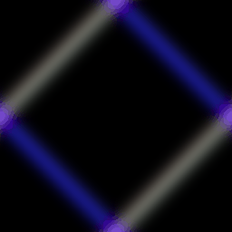
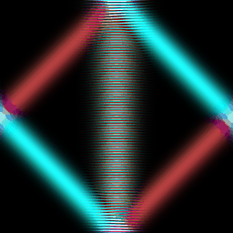
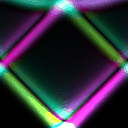
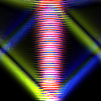
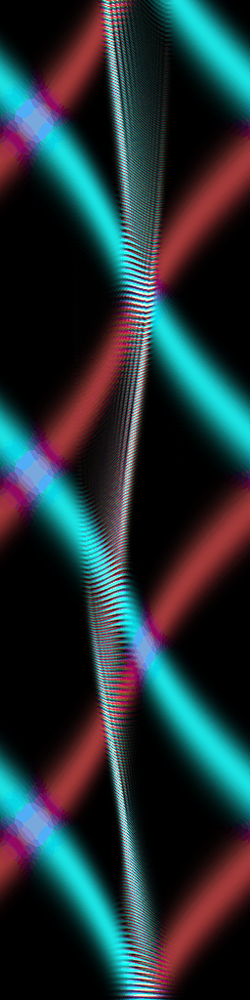
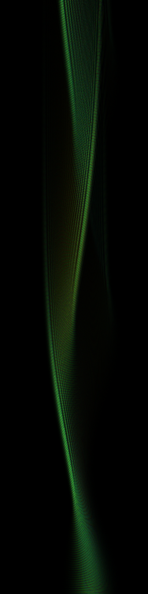
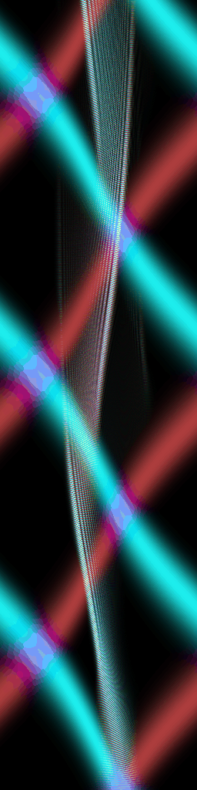
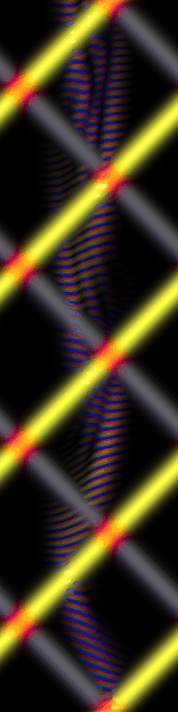
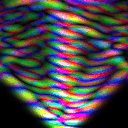
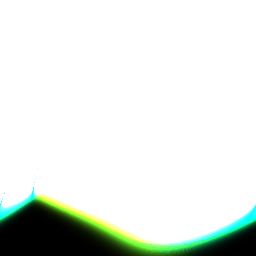

# The discrete geometric equation

*Keywords: Geometric calculus, Yee scheme, Dirac operator*

*What i cannot create, i do not understand*

## Abstract
We present a timestepping scheme for the discrete geometric derivative over multivector valued fields of arbitrary grades. It may be viewed as a generalization of the Yee scheme for the Maxwell equations, to geometric derivatives over arbitrary multivector-valued discrete spacetime fields, inheriting the favorable properties of the Yee scheme, such as its simplicity and conservation properties. 

We expect schemes in this family to be of practical value in applied relativistic field problems. But our primary motivation lies in providing better conceptual tools, to advance the state of understanding of field equations and their character. It is one thing to write down an equation, but another to appreciate the dynamics that this equation implies.

We provide self contained runnable code examples of the presented method, and perform a set of experiments to demonstrate its properties as a physical modeling tool. To our knowledge, this represents the first direct numerical simulation of a relativistic spinor field; as runnable in realtime on a smartphone.

## Introduction
The Yee scheme for timestepping the Maxwell equations has been very successful. First published in 1966, it remains a workhorse of computational photonics today. Not only has it been very valuable as a practical engineering tool, but also as a didactic tool in providing insight in the structure of the Maxwell equations. 

When the Yee scheme is viewed through the lens of discrete geometric calculus, as a set of relationships between bivector fluxes residing on the faces of a space-time grid [^GCE], we may observe that the Yee scheme corresponds directly to a discrete expression of the fundamental theorem of geometric calculus, which is key to its favorable conservation properties.


However, to the best of the authors knowledge, no conceptually or practically similar techniques have hitherto been described for more general multi-vectorial wave equations. 

The Dirac equation describes the massive counterpart to the Maxwell force carrier, and as such is of similar practical and theoretical interest. A number of different formulations of the Dirac equation have been put forward in its near century since publication, which capture the same essential algebraic properties, motivated by the physical goal to model a concept of spin. 

Arguably, the complex-valued matrix-representation as originally formulated by Dirac is not the easiest to intuit. Hestenes set out to reframe the Dirac equation in terms of geometric algebra, seeking a real valued representation. In such a geometric formulation, the algebraic elements squaring to -1 are the result of the anti-commutativity of the exterior product, and hence directly map onto a geometric entity such as a plane, which one may interpret as the plane of rotation.

In geometric calculus notation [^geometric_derivative], we may state the Dirac operator as: 

```
geometric_derivative(phi) = 0
```

with `phi` an even-grade field over the spacetime algebra.

By suggestive comparison, in terms of geometric calculus, the homogenous Maxwell equations can be stated as:
```
 geometric_derivative(F) = 0
```
with `F` a bivector field over the spacetime algebra. 

The maxwell equation thus viewed has a residual of mixed grade 1 and 3. In the Maxwell case the more usual framing is to write this as a pair of equations `interior_derivative(F) = 0` and `exterior_derivative(F) = 0` [^EC]; though we argue that viewing this as a single equation with a residual in the space of odd-grade multivectors provides a more unified view; a view that is important to the line of reasoning we develop here [^geometric_equation].

Framed in this way, we see that the homogenous Maxwell equation and the Dirac operator in 3+1 spacetime differ in only one respect; the Maxwell equation is formulated as a field over grade-2 bivectors, where the Dirac operator is formulated over a field of even-grade multivectors; that is, grades 0+2+4. Under the action of the geometric derivative, both have a residual in the space of odd-grade multivectors, of grades 1+3.

From a discrete calculus perspective, there exist a unique natural location for such additional field components; just as the grade-2 fluxes are naturally associated with the faces of the space-time grid, the 0 and 4 grades are naturally associated with the vertices and hypervolumes of the space-time grid.

This leaves open the question, if a suitable discrete operator can be constructed relating those elements, and if that permits the construction of an effective time-stepping scheme, with favorable properties. 

We will approach these questions by generalizing the logic implicit in the Yee scheme, to fields of arbitrary grade.


[^GCE]: 
    To our knowledge, the space-time view of the Yee scheme was first explicitly articulated in [Geometric Computational Electrodynamics](https://arxiv.org/pdf/0707.4470.pdf)

[^EC]: 
    In exterior calculus, the geometric-vector-derivative can be written as `d + *d*`. Both encompass the same idea, in a somewhat different mathematical dialect; in both cases it is a combination of a grade-lowering inner term and a grade-raising outer term. 

    Our viewpoint on the discrete domain is very well articulated in [Discrete Exterior Calculus](https://thesis.library.caltech.edu/1885/3/thesis_hirani.pdf). In line with the research direction articulated there, our outlook is to explore the internal logic of a discrete representation of core geometric ideas, and follow that logic where it may lead.
    
    Yet we feel the term 'Discrete Geometric Calculus' is more appropriate; both to be congruent with the line of thinking that led us to this work, but also because the key aspects of this work concerns itself equally with the interior and exterior part of the geometric product. Moreover, this work is orthogonal to concerns specific to the strict seperation of topology and metric, which tend to take a central role in expositions of exterior calculus. We feel that framing it in these terms would unnecessarily complicate ideas, which are of a rather striking conceptual simplicity by themselves. In this we second the opinions of [Hestenes](https://geocalc.clas.asu.edu/pdf-preAdobe8/MathViruses.pdf)

[^geometric_derivative]: 
    What we refer here to as the 'geometric-derivative', is in many contexts refered to as the 'vector-derivative'. In both cases we can state this operation verbosely as 'the geometric product of a 1-vector of differential elements with the operand'. A natural way to shorten that phrase without losing any information would be 'vector-geometric-derivative'. Depending on context, it may be appropriate to leave one, or both of those adjectives implicit. 
    
    Since in this document we are not concerned with more general multi-vectorial derivatives, but only concern ourselves with 1-vector derivatives, we do elect to leave the 'vector' part implicit. In some contexts in this document, where we care to distinguish the 'exterior' and 'interior' portions, linguistic consistency would demand we refer to their sum as the 'geometric derivative'. In some other contexts, such as in the latter parts of this document, both adjectives may be suffiently constrained by context, and the bare symbol `d` leaves no room for ambiguity. 
    
    Seeing as how frequently used operations like gradient, curl or divergence can all be stated as either 'vector-interior-derivatives' or 'vector-exterior-derivatives', the term 'vector-derivative' as shorthand for 'vector-geometric-derivative', or overloading meaning of the nambla symbol as 'vector-geometric-derivative' when it already has widespread use in vector calculus as the 'vector-exterior-derivative', seems liable to understate the crucial distinction between geometric and vector calculus, to those only familiar with the latter. And it is the latter which we expect to make up the majority of the readers of this article.

[^geometric_equation]: 
    We prefer to refer to the equation `geometric_derivative(phi) = 0`, or `d(phi) = 0` for shorthand in appropriate context, as ‘the (first order homogenous) geometric equation’. If it is important that we restrict our attention to particular subspaces, we prefer to speak of ‘the geometric equation over the bivectors’ rather than 'the Maxwell equation'. Such a language is not merely a label based on superficial similarities; in all cases, we are speaking of the same operator; a geometric product of the field, with a 1-vector of the (differential) elements in our domain. 


### Space-time grids

In this work focuses on the discrete domain of the n-dimensional cube-complex. Such cube complexes, cube girds, or grids for short, can be said to obey a geometric algebraic logic, that is exactly analogous to the way we think about the basis blades of a geometric algebra, and their interactions under the geometric product. For instance, we may say that a 2-cube, or square, denoted `xt`, will be projected down onto a 1-cube or line `x`, under the action of an interior product with `t`; and conversely, taking the exterior product of the line `x` and `t`, will again span the 2-cube or square `xt`; and so on for all higher dimensions. When we refer to an element `xt`, we may interchangeably refer to it as an element of the geometric algebra, or as the corresponding 2-cube of the cube-complex under consideration.

For illustration, see below the labeled elements of a `xt` cube complex, with integer coordinates assigned to all elements, denoting their `x` and `t` coordinate locations respectively. We call elements that contain the element `t` 'timelike', and all elements that do not contain the element `t` 'spacelike'. We may state the that spacelike edge `x01` is part of the boundary of the timelike face `xt00`; and that the timelike edge `t10` is 'incident to' the spacelike vertex `00`; and so on for higher grade elements. We may elect to view such boundary and incidence relationships over a complex as a sequence of topology matrices, effectively defining each oriented n-element in terms of its oriented n-1-boundary.

```
 --.......--.......--
 ||       ||       ||
t01 xt01 t11 xt11 t21
 ||       ||       ||
 01==x01==11==x11==21
 ||       ||       ||
t00 xt00 t10 xt10 t20
 ||       ||       ||
 00==x00==10==x10==20
```

### Geometric derivative
From the DEC perspective, the discrete exterior derivative over any component of the field, amounts to a summation over all boundary elements, defining that element. For instance, the exterior derivative of the 1-vector edges, through oriented summation, gives us a value defined on all 2-vector faces.

From a discrete geometric perspective, we may view the discrete geometric derivative, as the product of all elements in the field, with a 1-vector of all positive and negative 1-elements, or lines in the domain. Take for instance the element `t10` above; the product with the 1-blade `x` would span the element `xt10` on the right; and its negative `-x` would span the element `-xt00` on its left. Similarly we can interpret an inner product with `t` as projecting the edge `t` up or down onto its boundary vertices. We can employ identical logic for all other terms we thus encounter in the product; and if we collect all resultant colocated field elements, as applied to a grid of (hyper)cubes, this will give rise to the same familiar finite difference, or DEC stencil as derived from an oriented topology. In practice, working on a grid of hypercubes, all differential operators can be expressed as simple differencing operations between contiguous elements of an array.

In summary, we note that the geometric derivative for any element of the algebra, states a relationship between its boundary and incident elements, or those of one grade up and one grade down. 


## Leapfrog scheme
Without loss of generality, we first illustrate the logic behind the discrete geometric derivative leapfrog scheme over a field of arbitrary multivectors, in a single spatial dimension, to facilitate visualization.

 * Assume that the state of a multivector field at a given timelike slice `t` (say `t=1` in this case) is fully determined.

 * Note that the state of the field on all edges of the boundary of the timelike faces `xt` are known, except for the value on the future spacelike edges `x`. This means the geometric derivative over timelike faces `xt`, uniquely determines the value of the future spacelike edges `x`

 * Moreover, all faces incident to the timelike edges `t` are known, and all boundary vertices are known, except for the value on the future spacelike vertices. This means the geometric derivative over timelike lines `t`, uniquely determines the value of the future spacelike vertices.

```
 02==x02==12==x12==22

 ||       ||       ||
t01 xt01 t11 xt11 t21
 ||       ||       ||
 01==x01==11==x11==21
 ||       ||       ||
t00 xt00 t10 xt10 t20
 ||       ||       ||
 00==x00==10==x10==20
```

As such, we have full determined the values of the next spacelike slice at `t=2`.
Now that these values are known, we may proceed to the second step of the leapfrog scheme.

 * Note that the state of the field on all edges incident to the vertices at `t=2` are known, except for the values on the future timelike edges `t`. This means the geometric derivative over the spacelike vertices, uniquely determines the value of the future timelike edges `t`.

 * Moreover, all faces incident to the spacelike edges `x` are known, and all boundary vertices are known, except for the value on the future timelike faces `xt`. This means the geometric derivative over spacelike edges `x`, uniquely determines the value of the future timelike faces `xt`.

```
 ||       ||       ||
t02 xt02 t12 xt12 t22
 ||       ||       ||
 02==x02==12==x12==22

 ||       ||       ||
t01 xt01 t11 xt11 t21
 ||       ||       ||
 01==x01==11==x11==21
 ||       ||       ||
t00 xt00 t10 xt10 t20
 ||       ||       ||
 00==x00==10==x10==20
```

This completes one cycle of the discrete geometric derivative over the full multivector field in the algebra `xt`.

We may summarize the above in the following notation, in terms of component-wise 1-dimensional interior and exterior derivative operators:
```python
+edt(s)  = +idx(xt)
-edt(x)  = +edx(t)

-idt(t)  = +idx(x) 
+idt(xt) = +edx(s)
```
Where terms `idt` and `edt` reflect interior and exterior temporal differences respectively, (which could be implemented as an in-place update of the field component with the right hand side, scaled by an appropriate Courant number). Using the indexing scheme denoted above, the terms `edx` and `idx` reduce to simple upwind and downwind first order differences. [Here](./../numpy/minimal.py) one may find a self contained example illustrating these principles.

Generalizing the logic behind the above steps, we may construct a general algorithm for timestepping the geometric equation, `d(phi) = 0`, over algebras of arbitrary dimension and signature:

1. We construct all terms of the geometric product of `phi`, with a 1-vector of all (differential) elements in the domain of the field (this could be a subset of the basis elements of the algebra)
2. Each collection of terms corresponding to a single resultant geometric type forms a single equation. Each such equation contains (at most [^transverse_electric]) one `dt` term, which we collect to one side.
3. We observe that we may partition these equations into two independent sets, those updating space-like variables using differences of time-like variables, and those updating time-like variables using differences of space-like variables, respectively.
4. Profit

[^transverse_electric]: 
    for instance, doing this in an algebra `x+y+z+t-`, for a domain `x, y, t` (derivatives in `z` implied zero), over a field of a subset of bivector components `xt, yt, xy`, to simulate 2d transverse-electric fields, we obtain one equation `idx(xt) + idy(yt) = 0`; this has no time derivative, but can be viewed as a compatibility initial equation on the field; and can simply be ignored for the purpose of constructing the timestepping scheme.

Assuming the availability of a software library for managing the bookkeeping of signs involved in geometric algebra, the above steps can be readily implemented in a handful of lines of code, to produce a code-generator, for algebras of any dimension and signature; see [this](./../field.py) code example.

As an illustration of the structure of the resultant equations, we write this out for a full multivector valued field over `x+y+z+t-` to obtain:

```python
# temporal update of space-like variables using spatial derivatives of time-like variables
edt(s)    = +idx(xt)   +idy(yt)   +idz(zt)
edt(xy)   = +edx(yt)   -edy(xt)   +idz(xyzt)
edt(xz)   = +edx(zt)   -idy(xyzt) -edz(xt)
edt(yz)   = +idx(xyzt) +edy(zt)   -edz(yt)
edt(x)    = +edx(t)    -idy(xyt)  -idz(xzt)
edt(y)    = +idx(xyt)  +edy(t)    -idz(yzt)
edt(z)    = +idx(xzt)  +idy(yzt)  +edz(t)
edt(xyz)  = +edx(yzt)  -edy(xzt)  +edz(xyt)
# temporal update of time-like variables using spatial derivatives of space-like variables
idt(t)    = +idx(x)    +idy(y)    +idz(z)
idt(xyt)  = +edx(y)    -edy(x)    +idz(xyz)
idt(xzt)  = +edx(z)    -idy(xyz)  -edz(x)
idt(yzt)  = +idx(xyz)  +edy(z)    -edz(y)
idt(xt)   = +edx(s)    -idy(xy)   -idz(xz)
idt(yt)   = +idx(xy)   +edy(s)    -idz(yz)
idt(zt)   = +idx(xz)   +idy(yz)   +edz(s)
idt(xyzt) = +edx(yz)   -edy(xz)   +edz(xy)
```

Note that there is no direct coupling between even and odd grades through the discrete geometric derivative in any dimension; as one would expect. Hence it is possible to split the update scheme into independent blocks of even and odd grade, and the equations have been ordered to reflect that split. However, since we may introduce interactions between even and odd grades through additional terms (treated in proceeding chapters), we do present the scheme over the full algebra here.

Equations over subspaces of the full algebra, or lower dimensions, are contained in this scheme, and can be isolated by simply zeroing the relevant variables or derivatives. Note that we may observe the Yee scheme embedded in these equations, if we isolate only the bivector terms.

Terms accrue a sign according to the usual rules of geometric algebra; through the parity of the number of swaps required to bring the basis blades in a single (arbitrarily chosen but consistent) order. Furthermore, interior derivatives will accrue a sign according to the chosen metric.

While we have only implemented this scheme on cubical grids, extensions of this scheme to meshings that are (for instance) simplicial in the spatial dimensions, should be straightforward; as long as the total mesh can be viewed as a topological product of a 1-dimensional temporal grid with such a spatial discretization (without such a product structure, generalizations are still likely possible; not not as straightforward). More generally, it seems likely that many of the techniques developed in the context of the Yee scheme, such as asynchronous stepping or adaptive meshing, could be adapted to the setting of a geometric derivative over arbitrary multivector fields.


### Conservation and stability

We observe both theoretically and experimentally that this generalized discrete geometric derivative operator, has the same favorable conservation properties as the Yee scheme. No amplitudes are ever created or lost through evolution in time; they are merely exchanged between adjacent geometric elements.

Moreover, we empirically observe that the same well understood CFL conditions as known from the Yee scheme seem to apply, to keep the solution not only conserved, but also finite and stable.

We note that it would appear impossible to construct a leapfrog scheme of this nature, given an equation involving only parts of the geometric derivative, such as the exterior or interior derivative. It appears to be an essential quality of the full geometric derivative, and its invertibility, that naturally presents itself as a conserved flow on discrete spacetime.


### Results

All the figures below pertain to the impulse-response of a pure geometric equation `d(phi) = 0`, (initial condition formed as the product of a gaussian of the spatial variables, with a random sampled value for each field component.) Unless otherwise stated, these are results over the full algebra. All spatial boundary conditions are periodic.

<table>
    <th></th>
    <th></th>
</table>

<i>Left: Geometric equation over x+t-, xt plot; Right: and geometric equation over w+x+t-, xt plot.

In the left plot, an initial disturbance generates only light-like waves propagating outward.

In the right plot, the `w` dimension is a compact dimension, of a length of 2 elements; the minimum required to sustain nonvanishing gradients in that dimension, and to facilitate a notion of a wave travelling 'around' the compact dimension. We may observe the emergence of excitations capable of traveling within the light cone, as viewed from the non-compact dimension `x`.
</i>

<table>
    <th></th>
    <th></th>
</table>

<i>Geometric equation over `x+y+t-`, `xt` and `xy` plot.

The sole difference with the above rightmost result, is that this view represents a slice from a non-compact dimension; and indeed we observe only propagation along the light cone.
</i>

<table>
    <th></th>
    <th></th>
</table>

<i>Geometric equation over the even subalgebra of `w+x+y+t-`, `xy` and `xt` plot. Compact w dimension.

The even grade homogenous equation can be viewed as a model of the massless neutrino, exhibiting lightlike waves propagating outward. Here too, the initial condition excites a stationary mode in the compact setting, which is absent in the non-compact setting.</i>


In the preceeding examples, we assumed the most simple form of metric, where all the 1-vectors forming the vector-geometric derivative have a length of 1. Allowing for a metric that is variable in space, though static in time, for instance `dt = 1 - guassian(x) / 2`, we can gain further insight into the character of the different modes in excitations in space `w+x+t-` where the dimension `w` is compact. This is a Newton-Cartan model of linearized gravity. Note that such a modification to the metric is isomorphic to allowing for a spatial variation in the 'speed of light'. [^bell_ftw]

[^bell_ftw]: Note that in such a setting, a two-way measurement of the speed of light, would find a constant value, independent of its location inside or outside a gravity well. The matter of which the apparatus consists would find its equilibrium configuration through two-way exchange of forces, via the same medium that we are testing the two-way speed of. The ratio of two identical things is a constant, and like any tautology worth its salt, this does not depend on a reference frame, amongst other things.



<i>
We note that the lightlike modes change their spatial wavelengths as they enter and exit the well. (Note that the color by which they are visualized here is unrelated to spatial wavelength).

Moreover, the 'massive' mode, starting out without momentum inside the well, accelerates towards the center, but stays trapped inside the well.
</i>


### Discussion

We note that any combination of vector grades seems to form a well posed wave equation. The only exception to this rule are the (pseudo)scalar grades; their update rule trivializes when they are taken in isolation. In first order form, the equations demand only constant fields are valid solutions, since every constraint over an edge connected its vertices, but not to any faces, demands both sides have the same value. The discrete theory is consistent with the implications of continuum theory in this regard. 

Note that in composite grade wave equations that do contain a scalar part, that scalar part does not trivialize; both updating itself through interactions with adjacent grades, and influencing their updates in turn. 

While the pure homogeneous equation admits only solutions traveling along the light-cone, we observe that the addition of ‘compact’ dimensions with a periodic boundary conditions, naturally result in the emergence of both ‘massless’ and ‘massive’ excitations of the field; those traveling along the light-cone, or those traveling within the light-cone, respectively. Of course fundamentally the homogeneous equation only admits solutions traveling along the light-cone; but waves winding around the compact dimension appear as waves moving within the lightcone, as viewed from the non-compact dimension. 

We may view the compact dimension as a waveguide, with the modes that are lightlike representing excitations orthogonal to the compact dimension. In direct analogy with classical waveguide theory, we would expect a spectrum of massive modes to emerge, with a finite number of ‘generations’, depending on the ratio between the fundamental wave propagation speed of the field, and the size of such compact dimension(s). 

We note that such mechanisms have been proposed in mathematical physics before. We limit ourselves here to presenting a mathematical tools, and we consider a thorough exploration of the applicability of such tools to physical models beyond the scope of this work. 

However, we do want to emphasize the didactic potential of being able to demonstrate and explore the applications and limitations of such mechanisms, which are traditionally considered highly advanced topics, in a handful of lines of rather simple code.


## Zero order terms

We cover here some additional terms, to study their interaction with the discrete geometric derivative operator. We do not set out with the goal of modeling a particular physical system, but rather intend to explore the internal logic of the discrete space, and see where that leads us.

We emphasize that this represents only a cursory exploration of the type of dynamics naturally expressed within the discrete setting, and we emphasize that any possibilities not observed here, should not be taken as an indication of them being unlikely to exist.

### Direct zero order

Aside from the pure geometric equation `d(phi) = 0`, it is inviting to consider equations of the form `d(phi) = m * phi`. Here, `m` could be a single constant or a function of the domain variables. 

Written out for a full multivector in `x+t-`, collecting and equating colocated and geometrically identical elements, we would thus have:

```python
+edt(s)  = +idx(xt) +m*t 
-edt(x)  = +edx(t)  +m*xt

-idt(t)  = +idx(x)  +m*s 
+idt(xt) = +edx(s)  +m*x 
```

Note that this added mass term does not compromise the leapfrog structure of the scheme. We still have two blocks of equations, updating timelike with spacelike and vice versa. Every equation in the leapfrog scheme, now involves not only boundary and incident elements, but also accrues a contribution from the variable that is being leapfrogged. 

By definition of collecting and equating colocated geometric-algebraic identical terms, such terms can be added to the scheme in a consistent manner. Moreover, we emphasize that the addition of this term does not involve any ‘action at a distance’.

Also, note that through the addition of this zero order term, the equations no longer split into independent even and odd grade parts; but those even and odd grade components now interact. The above observations apply in spaces of any dimension and signature.

We suggestively use the name `m`, noting that such a zero-order addition to the equation, also leads to the emergence of solutions to the multivector wave equation that not merely lie along the light-cone, but may be stationary in space, or follow any path within the lightcone, and obey a frequency/momentum relationship, as one would expect of massive excitations of a field.

Should we make the mass term a function of the domain variables, we may realize a ‘potential’ term, where increasing overlap between the potential and the wave function is associated with higher energies, which the evolution of the wave function will seek to minimize. Unlike a potential well formed by a variable time dilation, such a potential term may trap both massive and massless excitations alike. 

We note that the term under consideration here is something quite different from masslike terms in a typical geometric algebra formulation of the Dirac electron.

The natural zero order term couples variables being updated, to the element they are being updated over; a difference of grade 1. A model formulated over the even subalgebra, where all odd grade components are 0 a priori, will see such a mass term vanish. In an equation over the even subalgebra, the edges only participate as the locations of the equations, or constraints; not as carriers of field values themselves. We will return to this in the section on alternative zero order terms.


### Results

<table>
    <th></th>
    <th></th>
</table>

<i>On the left, an `x+t-` simulation, with mass=2
On the right, `x+y+t-` simulation, without zero order term, and a y-dimension of size 2.
Both are subjected to the same initial conditions in `x`, and subject to the same time-dilation profile in `x`, to form a gravity well.</i>

Clearly, the one-up model is a richer model, admitting both lightlike and massive excitations, in a single field equation. Here we find at least a superficial justification in calling both types of excitations 'massive' excitations, in the sense that they show qualitatively similar behavior, in terms of their response to a gravity well, and in terms of building up a notion of momentum in terms of a spatial winding frequency of their field, capable of carrying it through the bottom of the potential, and up its opposing side.

It certainly seems likely that one may formally prove these models isomorphic, at least as far as the massive excitations are concerned. Infact an attempted outline of such a proof seems straightforward; all it requires is that there exist excitations for which additional gradients along the compact dimension, are proportional to the field values themselves. To those who subscribe to 'proof by believing your own eyes', the answer seems evident.


### Stability

We note that addition of the direct zero-order term, does not seem to have a negative impact on the conservation properties of the scheme in `x+t-`; and within some bounds on the magnitude of `m` (and not its sign!), this does not affect the stability of the scheme. There probably are good theoretical arguments for that; not the least of which would be isomorphism to the one-up scenario. This allows us to invoke the exact discrete form of the fundamental theorem of geometric calculus; amplitudes are being exchanged between elements, not created or destroyed.

More interestingly still, the opposite is true in a `x-t+` metric. While the pure geometric equation shows qualitatively similar behavior regardless of a spacelike or timelike metric, the direct zero order term seems to be unconditionally unstable.

We note that there appears to be no obstacle to adding both extra dimensions and a zero-order term. Nor to the addition of  multitude of extra dimensions.


We note that adding an extra dimension, doubles the number of distinct elements in the algebra. Likewise, adding a zero order term, through coupling the even and odd grades, allows us to construct a wave-equation with double the number of coupled components, compared to the situation without a zero-order term. Again, this hints at an isomorphism; and rather than thinking in terms of a zero-order terms on the full algebra, we may elect to think in terms of specific excitations of an even-grade subalgebra in a one-up space. We note that extra dimensions may not merely expand the number of algebraic elements, but also may expand the number of degrees of freedom.

To continue this line of questioning; insofar as the effects of a zero order term are isomorphic to a gradient along a compact dimension; spatial variations of that zero order term, or 'potentials', should be isomorphic to spatial variations of the compact metric. One famous example of an application of such a potential V, is as modelling the coulomb interaction when solving for the Dirac electron energy levels. Insofar as this isomorphism holds, replacing that spatially variable coulomb potential with a spatially variable compact metric, should 'just work'. We consider this an interesting geometric perspective on the electromagnetic force, which to our knowledge is not usually thought of in terms of variable metrics. [NOTE: this isnt true it would seem; the Kaluza–Klein models does exactly that]

Massive excitations, travelling primarily along the compact dimension, feel the effects of a spatial variation in the length of temporal edges, qualitatively different, than those excitations traveling orthogonal to the compact dimension. One might say that by 'loitering in place on the gradient', the massive excitations get more of chance to experience that gradient, than the lightlike excitations, not wasting any time going in circles, skipping over them along the shortest geodesic.

Similarly, we may reason about the effects of spatial variations in the length of the compact dimension, and the effects this would have on massive and lightlike excitations. For massive excitations, we expect an effect isomorphic to a coulomb potential; a slowing down of propagation along the compact dimension inside the potential, would cause waves to refract into the potential. For lightlike excitations, we would not expect them to experience variations in the compact dimension at all, travelling orthogonal to the compact dimension, as they do by definition. In this, we may see a geometric explanation, of the empirical observation, that we do not find massless charged particles in nature.

Running the numerical experiment indeed satisfies the above expectations:



Pure geometric equation, `d(phi) = 0` over `x+y+t-`, compact y dimension, `dy = 1-gauss(x) / 2`

Indeed by modulation of the length of the compact dimension, we attain a trapping of the massive excitation, identical to a coulomb potential `V * phi` of the same spatial profile; and indeed this effect is orthogonal to the propagation of lightlike excitations, in contrast to the direct zero order term.


### Discussion

Insofar as we can view electromagnetic forces as a metric effect in a one-up space, this can be said to be a unifying perspective with gravity, where we are used explaining in metric terms. However, even if it does predict the hydrogen spectrum, the coulomb potential in the Dirac equation is considered somewhat of a hack rather than a full model of electrodynamics. Similarly, it is also not difficult to point out limitations of this model of electrostatics. 

For instance, it is not obvious how to model both attraction and repulsion. Seeing as how all excitations of the geometric equation are either orthogonal to, or will diffract into such a potential well, this simple model by itself provides no more repulsion, than metric variations in the non-compact dimensions provide anti-gravity. Of course one might consider variations of the metric going the other way; but to retain the geometric picture, that it is the curvature of the compact dimension that generates the apparent force on waves travelling along geodesics, this would seemingly require us to think of positive and negative charged excitations as travelling around distinct compact dimensions, experiencing complimentary effects on their compact metrics. Which raises at least as many questions as it attempts to answer.

[NOTE: it is not clear to me how Kaluza–Klein gets around this; does it claim to be able to model both positive and negative charge purely as a metric effect, and if it does, what is wrong with the argument above?]

Again, our intent is to set the scope of this article to a self-contained presentation of the discrete geometric derivative, with some illustration of its properties amd utility. This limited scope should not be construed, as an exhaustive exploration of all such possibilities appearing to be in sight.

But for those purposes, in summary, we note that the dynamics of a direct zero order 'mass' term, can be viewed as a subset of the dynamics of a one-up-compact model. And that 'spatially varying mass'; or 'potential' terms are homologous to a spatial variation in the one-up-compact metric.

## Alternative field excitations

So far we have only considered simple dirac-delta, or gaussian impulse type excitations. These have two limitations as a tool; for wave equations over single grades, such as the Maxwell equations, such an initial condition contains non-propagating components, that do not satisfy the compatibility conditions. Secondly, such an initial condition excites mixtures of different modes of the equation, which complicates our ability to observe such modes in isolation.

Non-propagating field components can be removed by simply taking a difference of a field with itself once timestepped. Indeed this gives the intended result for the geometric equation over the bivectors, leaving only propagating components, no stationary ones. Repeated application of this filtering operation generates increasingly high frequency wave packets, and we may think of it as a power-iteration, amplifying high frequency components at the expense of lower frequency ones.

<table>
    <th></th>
    <th></th>
    <th></th>
</table>

*0, 1 and 2 power iterations on a gaussian excitation of a bivector field. After the first application, the non-Maxwellian non-propagating mode vanishes, and subsequent iterations continue to bring bring out higher frequencies contained in the original gaussian.*


The same filtering operation can be applied to a scenario having a compact dimension, and there we may observe dynamics that hitherto were not apparent. Rather than selecting out the lightlike modes, we see the modes traveling along the light cone vanish, under application of this filtering. Upon reflection this makes sense, as the power iteration selects out the highest frequency components, which given the way our initialization is constructed in the compact scenario, are the frequencies pertaining to the compact dimension.

<table>
    <th></th>
    <th></th>
    <th></th>
</table>

*0, 1 and 2 power iterations on an off-center gaussian excitation of a bivector field, with one compact dimension `w`, and a variable `w` potential well. Time has been sped up by [1, 8, 64] times respectively; without such scaling the untrapped excitations move too slow to manifest themselves as a seperate component; and the last frame would not notiably evolve at all in the given timeframe. Convergence to a true stationary solution seems faster than any polynomial power we have tried. Note that the trapped massive state radiates as it is accelerated by the potential, but that these are only a true lightlike radiation in the first picture.*

What we then see brought into focus is a wave component resembling the lightlike excitations; but traveling within the light cone. This wave component needs to have some motion around the compact dimension; by construction, and by its apparent subluminal motion from the non-compact dimension. However, it succeeds in doing so, without being influenced in its propagation by our imposed profile on the metric of `w`. 

Moreover, these subluminal excitations are also 'lightlike' in their response to a metric variation in `t`. Despite traveling arbitrarily slow within the light cone, they may escape an arbitrarily deep well in `t`, incurring only a change in wavelength as they do so, and unlike 'proper' massive excitations not being inclined to reverse their direction of travel.

Arguably these type of excitation defy our previous binary classification, in terms of lightlike and massive. In these qualities, one may be reminded of the massive bosons.

More curious still, is the effect of this power iteration on what we would formerly refer to as the massive excitaton. It too has its motion refocussed into the compact dimension. This excitation too, becomes more 'massive', in the sense that it is slower to accelerate into the potential well formed by the metric variation in `w`. But our justification for that terminology weakens, seeing as how this excitation is also slower to accelerate into a metric variation in `t`, which is contrary to our expectation of physical mass. With repeated application of the power iteration in a scenario having such a potential well, we may produce excitations that are **arbitrarily insensitive** to the influence of such potential wells and their gradients; like a surfer riding a wave in equilibrium. If they have not previously been named, we would propose to call these excitations 'grommet-solitons'.

It is interesting to reflect on the fact that we are still considering a homogenous first order linear equation here, `d(phi) = 0` in 3 spatial dimensions. The only 'exotic' thing we have done is to consider high frequency waves in one of the spatial dimensions; its 'compactness' or lack thereof being a mere matter of convenience.

Experimentally observing a levitating particle formed by some balance of internally recirculating neutrino-current excitatitions, balancing the effect of gravity, would be quite something; but if such compact dimensions exist in nature, is an open question, and even if they do and are stable, it would seem like quite the feat of experimental physics. 

However, we can observe all the same phenomena equally, both to fields over the even subalgebra, as well as the bivectors. They are a consequence of the compact dimension interacting with a potential, not of the mixing of multivector grades.

As such, one might actually expect to be able to observe such grommet-solitons in physical electromagnetic waves. A coaxial cable or waveguide with a variable radius, excited with a wave travelling primarily around the waveguide, may actually serve as a physical realization. If so, one may expect these modes to already have a name in waveguide theory (do they?); however, they might be difficult to realize for substantial duration in a dissipative system, nor is it obvious how to efficiently excite them, either by accident or intentionally, seeing as how they are orthogonal to the more common modes. We emphasize that these solitons distinguish themselves from a usual trapped mode in a resonant waveguide cavity, by their stationary localization on one of the sides of the cavity, as opposed to a more common standing wave, which is distributed and can be viewed as a superposition of traveling waves reflecting off both sides of the cavity.


## Alternative zero order terms

What we call the 'direct' zero order term, is not a unique method of adding zero order terms to the geometric equation.

For instance, the equation `d(phi) = m * dual(phi) = m * phi * I`, with `I` the pseudoscalar of the relevant space, is also inviting to consider.

Note that if we consider dualization with `I` in a 3+1 algebra, this term vanishes on the even subalgebra, just like the direct zero order term does.

If we are to couple the residual of the geometric equation on the even-grade, which is odd-grade, we also need a grade-toggeling dual; which the pseudoscalar `xyzt` is not.

To that end, we may also consider multiplication by merely the element `t`, or alternatively the combined multiplication with `I` and `t`, to obtain the spatial pseudoscalar (SPS). These operations do map between even and odd grades.

While all these constructions are algebraically valid, we note that all of these alternative zero order constructions present an issue in the discrete setting. While the direct zero order term is colocated on the discrete grid with the constraint being applied, all these alternatives are not. In case of the SPS term, at least the variable being sampled lives in the same temporal slice as the variable being stepped over, whereas in those constructions involving the element `t`, this is not the case

SPS zero order term. Note that an unbiased implementation requires an interpolation step. Taking the first line; this is an equation over lines `t`; and rather than coupling to zero order with `t`, we couple to the average values of the elements `xt` adjacent to `t`, which are the product of `t` with the SPS; or the dual of the left hand side, variable that is being time-stepped.
```python
+edt(s)  = +idx(xt) +m*xt 
-edt(x)  = +edx(t)  +m*t

-idt(t)  = +idx(x)  +m*x 
+idt(xt) = +edx(s)  +m*s 
```
Illustration of code with SPS `x` zero order term.

Since these SPS terms do not toggle spacelike and timelike, they do not break the leapfrog structure. Zero order terms that do involve `t`, do break the leapfrog structure. 
```python
+edt(s)  = +idx(xt) +m*s
-edt(x)  = +edx(t)  +m*x

-idt(t)  = +idx(x)  +m*t 
+idt(xt) = +edx(s)  +m*xt 
```
Illustration of code with `t` zero order term.

One may argue that this is merely a superficial breaking of the leapfrog scheme; after all, we may still seperate all timelike and spacelike variables to opposing sides of the equals sign. This raises another question however; if the first equation is an equation over the element `t`, and it draws influence from `s`, we should realize the past and future `s` are equidistant from the perspective of `t`, and we also would need to interpolate over the time dimension, to avoid bias in one direction. Still, we may solve this pointwise implicit equation, and this does not preclude us from forming an update rule of `s` in terms of just timelike variables.

The same is not as easily claimed for a full dual zero order term, involving all elements of the algebra. This would require interpolation both in space and time to avoid sampling bias; and if there exist a simple way to solve for the implicit dependency on the future stencil, it eludes us as of yet.


### Results

We note that the SPS mass term, upon visual inspection, appears qualitatively quite different from the direct zero order term.



It is characterized by light-like modes that oscillate between different field components, and as animated through a spatial slice, appears to do more justice to the term 'spinor', than the direct mass term does.


### Discussion


## Systems of equations

have been implemented, look like they do interesting things, but need to be caught up with the latest code rewrite

## Nonlinear terms

Various nonlinear terms have historically been proposed, as modifications to the relativistic wave equations. 

We note that geometric calculus, and discrete geometric calculus in particular, offer a more structured perspective on such nonlinear terms. We can think of geometric algebra as a more 'strongly typed' language, compared to a non-geometric algebra. And similarly, not every term that seems natural in a continuous setting, seems equally natural in the discrete setting, where considerations of colocation of variables take on a more acute form, which would be swept under the rug, wisely or not, by a continuum limit.

We note that in the discrete geometric calculus setting, one operation that is always permitted, is to reduce graded elements to scalars via an inner product with themselves; and any (polynomials of such) scalar expressions can again be multiplied with the original element, to obtain cubic terms.

Aside from nonlinearities of this kind, it is of course interesting to consider those nonlinearities that may arise, by coupling the metric variations encoded in the basis blades from which we construct our derivative operators, to the field variables themselves. For any field that does admit a grade-1 component, or for which one can be derived through application of the geometric derivative, the simplest form of such nonlinearity is straightforward indeed. However, should we seek some polynomial expression of such 1-vectors, we should again be mindful of the fact that raising a vector to some power naively, does not result in an expression of a 1-vector type.

The mechanisms for making 'space guide matter', seems quite constrained. At least within the context of the vector-geometric-equation; modulations of the length of the 1-vectors that form our geometric derivative seem like the only option.

Which are viable mechanisms for making 'matter guide space' seems like a more open question; and what the most 'minimal coupling' is, capable of generating interesting behavior, or constructing models of the physical world, seems like it has a lot of room for exploration.

Especially the question of which one of such couplings may find an elegant expression in the discrete setting, seems like very interesting future work.


## Open questions

While the pure geometric equation states a conservation principle, in our journey of debugging code, and trying out different terms in the equation, one encounters many instabilities. Now this is quite common of buggy wave simulation software, but there are two peculiar things here. First of all, it is not always a software bug, but it may arise as a consequence of 'algebraically reasonable' looking equations, implemented by a well-vetted code generator. 

Secondly, while a typical wave equation bug manifests itself as an unstable high frequency component, we may observe both 'UV' and 'IR' divergences; high or low frequency runaway components, that refuse to go away simply with more conservative timestepping.

Notably, attempting to imbue the simplest model having spin degrees of freedom with a SPS mass term, that is `d(phi) = phi * I * t * m`, with `phi` even-grade in `x+y+z+t-`, does not seem to trigger divergence. However:

 * The same model in `x+t-`, triggers IR divergence.
 * The same model in `x-t+`, does not trigger IR divergence.
 * The same model in `x+y+z+t-`, triggers IR divergence.
Note that none of these observations are impacted by the sign of `m`.



Appearance of a typical divergence. Note the uniform appearance, and absence of high frequency components.

At present we lack a full taxonomy of all possible combinations influential in deciding divergences, but in summary:

 * The pure geometric equation does not exhibit divergences, regardless of signature, and we have a solid theoretical argument as to why, being the fundamental theorem of geometric calculus.
 * A spacelike signature seems unconditionally compatible with a direct zero order term, and we have a tentative theoretical argument as to why.
 * Some spacelike signatures are compatible with a SPS zero order term.
 * Some timelike signatures are compatible with a SPS zero order term.

NOTE: there are still some known and suspected shortcomings and bugs in the code relating to SPS terms; and conclusions regarding SPS are all quite tentative


## Conclusions

We have presented a discrete geometric derivative operators over spacetime algebras of arbitrary dimension and grade.

We find that it readily lends itself to efficient and stable simulations of relativistic wave phenomena. 

Its dimension and grade agnostic formulation, deriving from its geometric algebraic roots, combined with code generation in any dimension and signature, lends itself readily to experimental investigation of the dynamics implied by a variety of types of equations.


### More random observations

We note that bivector fields that satisfy the geometric equation, can have the implicit-zero elements of the even grade subalgebra made explicit, and they will still satisfy the geometric equation. That is, from the geometric-algebraic perspective, it is natural to view electromagnetic waves in free space, as a particular type of excitation of a unified neutrino-photon field. 

We note that the geometric equation over the bivectors, in the absence of 'compatibility initial conditions', may contain non-propagating modes; nonzero configurations of bivector fluxes, that do not contribute to any time derivative; whereas we do not observe such a thing in the even subalgebra. To understand that, we may compare the update rule in (wlog) `x+y+z+t-` for the even subalgebra and the bivectors. In doing so, we may observe that those spatial gradients of the bivectors that may vanish for the temporal derivatives of the bivectors, form the complimentary (interior/exterior) part of a geometric product, with the spatial gradients of the bivectors that form the temporal derivatives of grades 0 and 4. By invertability of the geometric derivative, those nonzero bivector field components that result in zero update to the bivectors, must result in nonzero updates to grades 0 and 4, and vice versa [^HHD]. This explains the empirical observation that no matter how careless one is in initializing an even grade field, one never observes non-propagating components in free-space. The even grade field is the simpler and more complete object to work with than the bivectors, in that sense.

[^HDD] modulo global-harmonic components of the field, as per the Helmholtz-Hodge decomposition, such as for instance global constants, which have vanishing gradients everywhere and in all directions.

We note that pure 1-vector fields, also contain non-propagating components; and appyling the same logic to the odd-grade algebra, we see that we should also expect the absence of nontrivial nonpropagating modes there, which is consistent with experience. It is not the algebra of the subspace itself being closed that is the deciding factor, but rather the closure of the space under geometric multiplication with a 1-vector, which is the deciding factor in this qualitative difference; which makes sense.
